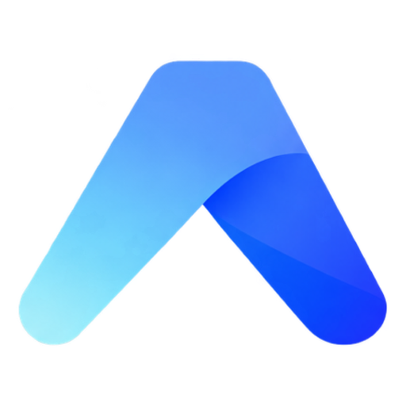
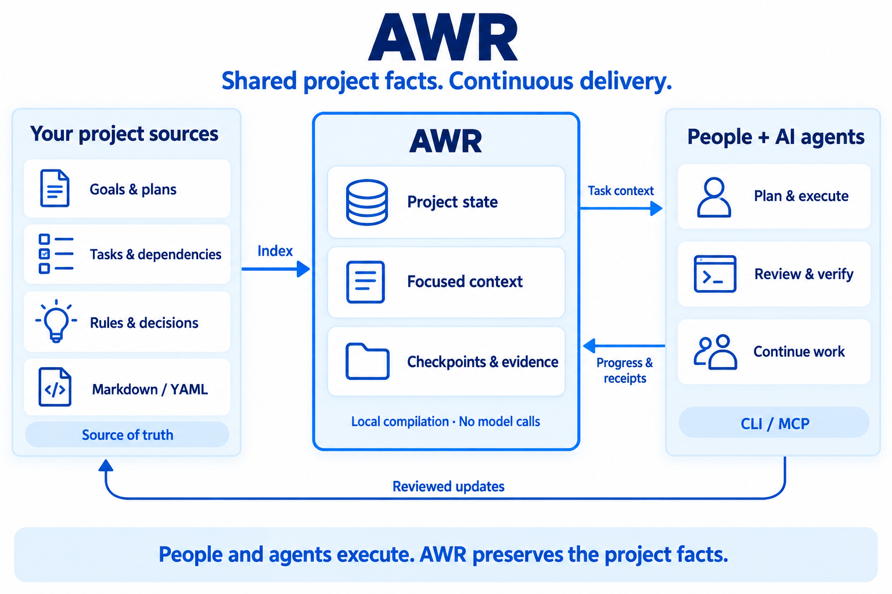

<div align="center">



# AWR

**The open-source project delivery platform for people and AI.**

Keep the goal. Connect the work. Make delivery traceable.

[English](README.md) · [简体中文](README.zh-CN.md)

[](LICENSE) [](https://github.com/originoneai/awr/releases) [](https://www.npmjs.com/package/@originoneai/agent-work-runtime) [](https://pypi.org/project/agent-work-runtime/)

[](https://awr.originoneai.com/) [](#quickstart)

[Documentation](docs/TAKEOVER.md) · [Releases](https://github.com/originoneai/awr/releases) · [Report an issue](https://github.com/originoneai/awr/issues) · [Contribute](CONTRIBUTING.md)

</div>

---

AWR gives people and AI agents a shared, durable record of a project: its goals,
work, dependencies, decisions and evidence. It connects your existing project
sources to the agent you already use through **CLI or MCP**, so the next session
can find the current task and continue from recorded progress.

People and agents plan, execute and review. AWR preserves the facts they need,
compiles focused context, and makes handoffs and completion claims inspectable.

## Use cases

| When you need to… | How AWR helps |
| --- | --- |
| Keep a long project moving | Preserve goals, unfinished work, checkpoints and the next action across sessions. |
| Hand work to another agent | Compile the relevant rules, task state, acceptance criteria and dependencies from shared project sources. |
| Coordinate parallel tasks | Track prerequisites and session claims, and distinguish ready work from waiting or blocked work. |
| Check what was actually delivered | Link completion to a source version, verification report and evidence, rather than a status label alone. |
| Bring an existing project under management | Preview the current Markdown/YAML sources and map their vocabulary before accepting initialization. |

## Core capabilities

| Capability | What it provides |
| --- | --- |
| **Source-backed project state** | Goals, tasks, rules and decisions remain connected to authoritative project files. [Project intake](docs/TAKEOVER.md) |
| **Focused context** | Task-specific context with a token budget, required facts and explicit completeness information. [Measured example](docs/benchmarks/README.md) |
| **Work navigation** | Current, ready, waiting and blocked work, plus bounded guidance for the next action. [Daily work](docs/reference/daily-work.md) |
| **Session continuity** | Claims, checkpoints, open loops and recovery inspection across conversations. [Session workflow](docs/integrations/session-workflow.md) |
| **Traceable delivery** | Version-bound evidence and acceptance checks; recorded completion stays distinct from verified completion. [Completion guide](docs/TAKEOVER.md#organize-and-recheck) |
| **Shared access** | Local stdio MCP or one HTTP service for explicitly registered projects and multiple clients. [Shared MCP service](docs/reference/mcp-service.md) |

**Available today:** the published **0.5.0** CLI/MCP packages provide the personal
project workflow, shared HTTP MCP and Personal Workspace file exchange. The
optional [Inspector](https://github.com/originoneai/awr/tree/v0.5.0/tools/inspector)
is run from source and is not bundled in npm/PyPI.

**In development:** Team collaboration, isolated workstreams and advanced
cross-workstream delivery are being developed on `main`. They have separate
contracts and are **not included in the 0.5.0 installation below**. See the
[release notes](https://github.com/originoneai/awr/releases/tag/v0.5.0) for the
published boundary and [project updates](#project-updates) for source progress.

## Quickstart

### 1. Install AWR

Choose one package manager. Both install the native `awr` and `awr-mcp` commands.

```sh
npm install -g @originoneai/agent-work-runtime@0.5.0
```

Or, inside a Python virtual environment:

```sh
python -m pip install agent-work-runtime==0.5.0
```

```sh
awr --version
```

Prebuilt packages support **macOS 15+ (Apple Silicon and Intel)**,
**Linux x64/arm64 (glibc 2.39+)** and **Windows x64**. Launchers require
Node 22.14+ or Python 3.9+. See the
[0.5.0 installation and upgrade guide](https://github.com/originoneai/awr/blob/v0.5.0/docs/release/DISTRIBUTIONS.md).

### 2. Connect your project

Run these commands from your project directory. Replace the example goal with
the outcome you want to deliver.

```sh
awr init --goal "Deliver a reviewed documentation update"
```

Review the proposed sources and mappings, then accept the same goal:

```sh
awr init --goal "Deliver a reviewed documentation update" --accept
awr status
awr intake inspect
```

Initialization preserves existing project sources and proposes missing structure.
If intake reports `NeedsOrganization`, let your agent complete the goals, tasks
and acceptance criteria before starting implementation. See the
[project intake guide](docs/TAKEOVER.md) for custom fields and existing ledgers.

### 3. Give your agent the working agreement

With CLI access to the initialized project, give your agent this instruction:

> Use AWR to manage this project. Start by reading the current goals, tasks,
> dependencies and checkpoint. Record this request with clear acceptance criteria
> and a next action. Keep progress and verification evidence current as you work,
> and save a checkpoint before stopping. In the next session, check for source
> changes and continue from that checkpoint.

You can inspect progress at any time with `awr status`. For the explicit
claim → context → checkpoint workflow, see the
[session guide](docs/integrations/session-workflow.md).

<details>
<summary><strong>Connect through MCP instead</strong></summary>

After initialization, add an entry like this to your client's MCP configuration.
Use the client's documented configuration format and your project's absolute path.

```json
{
  "mcpServers": {
    "awr": {
      "command": "awr-mcp",
      "args": ["--project", "/absolute/path/to/your/project"]
    }
  }
}
```

Reconnect the client and confirm the project identity before making changes.
For multiple clients and projects, use the
[shared HTTP MCP service](docs/reference/mcp-service.md). See the
[MCP reference](crates/awr-mcp/README.md) for configuration and tool discovery.

</details>

## Architecture

<p align="center">
  
</p>

1. **Your files hold the intent.** Markdown/YAML describe goals, plans, work,
   constraints and decisions; AWR indexes them without silently replacing them.
2. **AWR maintains continuity.** Local state holds projections, sessions, claims,
   checkpoints and evidence. Context compilation runs locally and makes no model
   calls; revision checks protect writes from stale state.
3. **People and agents do the work.** CLI/MCP connects the facts to the chosen
   host. Agents bring their own models, tools and conversations; reviewed changes
   and progress return to the project.

AWR preserves **project continuity across finite context windows**. Native
compaction and the agent's private conversation remain host responsibilities;
recorded checkpoints do not reconstruct unrecorded history. See
[context continuity](docs/integrations/context-continuity.md).

## Agent ecosystem

Use the agent you already work with. **The common entry point is CLI/MCP**;
optional lifecycle adapters provide deeper integration where supported.

| Entry point | Documentation |
| --- | --- |
| Any CLI/MCP-capable agent, including Claude Code | [Generic session workflow](docs/integrations/session-workflow.md) |
| Codex | [Optional lifecycle adapter](docs/integrations/codex.md) |
| Cursor | [Client configuration](docs/integrations/cursor.md) |
| Kimi Code | [Host integration note](docs/integrations/kimi.md) |
| Grok Build | [Host integration note](docs/integrations/grok.md) |
| Application or custom harness | [Host contract](docs/reference/host-contract.md) |

Hook availability and activation depend on the host. A configuration file alone
does not prove an automatic checkpoint or handoff occurred.
[Integration layers and boundaries](docs/integrations/README.md).

## Measured efficiency

On the [public, reproducible context benchmark](docs/benchmarks/README.md):

| Input material | Tokens | Reduction vs. reading all sources |
| --- | ---: | ---: |
| Complete Markdown/YAML corpus | 18,955 | — |
| Largest rendered task context | 4,998 | **73.6%** |
| Largest complete CLI JSON response | 12,748 | **32.7%** |

The sample contains **150 synthetic tasks**, with all **39 active tasks** checked
and **676/676 required facts** retained. Counts use `o200k_base` with a 5,000-token
context budget. The baseline is reading every source, not optimized retrieval.
JSON metadata adds overhead. These figures measure input material, **not total
model bills or answer quality**; chat history, model output and MCP framing are
excluded.

A separate [30-run workflow comparison](docs/benchmarks/workflow.md) reduced tool
calls by **18–27%** and returned text by **3.4–4.7%** while retaining the same
completion contracts. It does not measure real model-token or billing savings.
Context compilation measured **108 ms at p95** on one Apple M3 Max/macOS host
(30 calls after warmup), not a concurrency guarantee.

## Project updates

| Resource | What you will find |
| --- | --- |
| [Releases](https://github.com/originoneai/awr/releases) | Published changes, installation artifacts and upgrade notes. |
| [Issues](https://github.com/originoneai/awr/issues) | Bug reports, feature requests and design proposals. |
| [Pull requests](https://github.com/originoneai/awr/pulls) | Development and review; merged source may precede a package release. |
| [Official website](https://awr.originoneai.com/) | Product overview and usage entry points. |

## Contributors

Thanks to everyone who improves AWR through code, documentation, bug reports and
real project feedback. See the [contribution guide](CONTRIBUTING.md) to get started.

[](https://github.com/originoneai/awr/graphs/contributors)

## Community and support

- [Report a bug or suggest a feature](https://github.com/originoneai/awr/issues/new/choose).
- [Review or contribute a change](https://github.com/originoneai/awr/pulls).
- [Build from source and run checks](CONTRIBUTING.md).

When reporting a problem, include the AWR version, operating system, reproducible
steps and redacted output. Keep credentials and private project sources out of
public reports.

## License

AWR is licensed under [Apache License 2.0](LICENSE).
