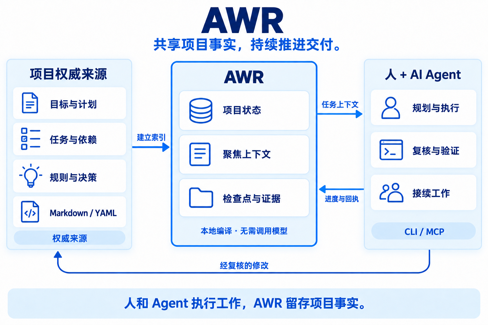

<div align="center">


# AWR

**人与 AI 协作的开源项目交付平台。**

让目标留得住，让工作接得上，让交付有依据。

[English](README.md) · [简体中文](README.zh-CN.md)

[](LICENSE) [](https://github.com/originoneai/awr/releases) [](https://www.npmjs.com/package/@originoneai/agent-work-runtime) [](https://pypi.org/project/agent-work-runtime/)

[](https://awr.originoneai.com/) [](#quickstart)

[使用文档](docs/TAKEOVER.md) · [版本发布](https://github.com/originoneai/awr/releases) · [问题反馈](https://github.com/originoneai/awr/issues) · [参与贡献](CONTRIBUTING.md)

</div>

---

AWR 为人和 AI Agent 保存一份可持续接续的项目记录：目标是什么、任务做到哪里、
依赖什么、做过哪些决策、交付有哪些证据。它通过 **CLI 或 MCP**，把已有项目资料
接到你熟悉的 Agent，让新会话能找到当前工作，从已记录的进度继续。

人和 Agent 负责规划、执行与复核。AWR 维护项目事实、提供聚焦上下文，
让任务交接与完成结论都有据可查。

## 适用场景

| 当你需要…… | AWR 能提供什么 |
| --- | --- |
| 持续推进一个长项目 | 跨会话保留目标、未完成事项、检查点与下一步。 |
| 把工作交给另一个 Agent | 从共同的项目来源中整理规则、任务状态、验收条件与依赖。 |
| 协调并行任务 | 记录前置依赖和会话认领，区分可开始、等待与阻塞的工作。 |
| 核对真实交付 | 把完成结论关联到来源版本、验证报告和证据，区分“标记完成”与“验证通过”。 |
| 接管已有项目 | 先预览 Markdown/YAML 来源与字段映射，再确认初始化。 |

## 核心能力

| 能力 | 具体作用 |
| --- | --- |
| **有来源的项目状态** | 目标、任务、规则和决策始终关联权威项目文件。[项目接管](docs/TAKEOVER.md) |
| **聚焦任务的上下文** | 按任务编译有 Token 预算的上下文，保留必需事实并给出完整性信息。[实测样例](docs/benchmarks/README.md) |
| **清晰的工作导航** | 区分当前、可认领、等待和阻塞事项，给出有明确条件的下一步指引。[日常工作](docs/reference/daily-work.md) |
| **跨会话接续** | 保存认领、检查点、未完成项与恢复依据。[会话流程](docs/integrations/session-workflow.md) |
| **可核对的交付** | 以绑定版本的证据核验验收条件，保留完成声明与验证结果的区别。[完成核验](docs/TAKEOVER.md#organize-and-recheck) |
| **共享接入** | 支持本地 stdio MCP，或用一个 HTTP 服务连接显式登记的多个项目和客户端。[共享 MCP 服务](docs/reference/mcp-service.md) |

**现在可以使用：** 已发布的 **0.5.0** CLI/MCP 安装包包含个人项目工作流、共享 HTTP MCP
和 Personal Workspace 文件交换。可选的
[Inspector 查看界面](https://github.com/originoneai/awr/tree/v0.5.0/tools/inspector)
需从源码启动，npm/PyPI 安装包不包含它。

**正在开发：** Team 团队协作、独立工作主线与更完整的跨主线交付机制在 `main` 中推进，
按独立合同验收，**不包含在下方安装的 0.5.0 版本中**。已发布能力以
[0.5.0 发布说明](https://github.com/originoneai/awr/releases/tag/v0.5.0)为准，
源码进展见[项目动态](#项目动态)。

<a id="quickstart"></a>

## 快速开始

### 1. 安装 AWR

任选一种包管理器，两者都会安装原生的 `awr` 和 `awr-mcp` 命令。

```sh
npm install -g @originoneai/agent-work-runtime@0.5.0
```

或者，在 Python 虚拟环境中安装：

```sh
python -m pip install agent-work-runtime==0.5.0
```

```sh
awr --version
```

预编译包支持 **macOS 15+（Apple Silicon 与 Intel）**、
**Linux x64/arm64（glibc 2.39+）**、**Windows x64**。
启动器需要 Node 22.14+ 或 Python 3.9+。详见
[0.5.0 安装与升级指南](https://github.com/originoneai/awr/blob/v0.5.0/docs/release/DISTRIBUTIONS.md)。

### 2. 接入你的项目

在项目目录中运行，把示例目标替换成你实际希望交付的结果：

```sh
awr init --goal "Deliver a reviewed documentation update"
```

检查预览中的来源和字段映射，再以相同目标确认：

```sh
awr init --goal "Deliver a reviewed documentation update" --accept
awr status
awr intake inspect
```

初始化会保留已有项目来源，并为缺失的组织信息提出草稿。
如果接入检查返回 `NeedsOrganization`，让 Agent 先补齐目标、任务和验收条件，再开始实施。
已有台账、自定义字段等接入方式见[项目接管指南](docs/TAKEOVER.md)。

### 3. 告诉 Agent 如何开始工作

Agent 可以在已初始化的项目中调用 CLI 后，把这段指令发给它：

> 请使用 AWR 管理当前项目。开始前先读取目标、当前任务、依赖和最近检查点；
> 为本次需求登记明确的验收条件与下一步。执行中及时记录进度与验证证据，
> 停止前保存检查点。下一次会话先核对来源变化，再从检查点继续。

你可以随时用 `awr status` 查看进度。明确的“认领 → 获取上下文 → 保存检查点”步骤，
见[会话工作流程](docs/integrations/session-workflow.md)。

<details>
<summary><strong>通过 MCP 接入</strong></summary>

初始化后，在客户端的 MCP 配置中添加类似下面的条目。
按该客户端的实际配置格式合并，并填写项目的绝对路径。

```json
{
  "mcpServers": {
    "awr": {
      "command": "awr-mcp",
      "args": ["--project", "/absolute/path/to/your/project"]
    }
  }
}
```

重新连接客户端，并在修改项目前确认项目身份。
多个客户端、多个项目共用服务时，使用[共享 HTTP MCP 服务](docs/reference/mcp-service.md)。
配置和工具发现方式见 [MCP 参考](crates/awr-mcp/README.md)。

</details>

## 工作架构

<p align="center">
  
</p>

1. **项目文件保存意图。** Markdown/YAML 记录目标、计划、任务、约束与决策，
   AWR 为它们建立索引，保留原始来源的权威性。
2. **AWR 维护工作接续。** 本地状态保存投影、会话、认领、检查点与证据。
   上下文在本地编译，无需调用模型；版本检查防止依据过期状态写入。
3. **人和 Agent 完成工作。** CLI/MCP 把项目事实接入所选宿主。
   Agent 使用自己的模型、工具与会话，复核后的修改与进度回到项目中。

AWR 支持的是**在有限上下文窗口之间持续接续项目**。
原生压缩和 Agent 的私有会话仍由宿主管理；检查点无法重建从未记录的历史。
详见[上下文接续](docs/integrations/context-continuity.md)。

## Agent 生态

沿用你熟悉的 Agent，**通过 CLI/MCP 使用共同的项目状态**；
在宿主支持的范围内，可选生命周期适配器能进一步连接自动检查点等能力。

| 接入方式 | 文档入口 |
| --- | --- |
| 任意支持 CLI/MCP 的 Agent，包括 Claude Code | [通用会话流程](docs/integrations/session-workflow.md) |
| Codex | [可选生命周期适配器](docs/integrations/codex.md) |
| Cursor | [客户端配置](docs/integrations/cursor.md) |
| Kimi Code | [宿主接入说明](docs/integrations/kimi.md) |
| Grok Build | [宿主接入说明](docs/integrations/grok.md) |
| 应用或自定义 Harness | [宿主接入合同](docs/reference/host-contract.md) |

Hook 能力与是否激活取决于宿主。配置文件存在，不代表自动检查点或交接已经发生。
详见[接入层级与边界](docs/integrations/README.md)。

## 可复核的效率数据

[公开、可复跑的上下文基准](docs/benchmarks/README.md)：

| 输入资料 | Token 数 | 相比全文读取减少 |
| --- | ---: | ---: |
| 全部 Markdown/YAML 来源 | 18,955 | — |
| 最大的渲染后任务上下文 | 4,998 | **73.6%** |
| 最大的完整 CLI JSON 响应 | 12,748 | **32.7%** |

样本包含 **150 个合成任务**，检查了全部 **39 个活动任务**，
保留 **676/676 项必需事实**。使用 `o200k_base` 计数，上下文预算为 5,000 Token。
对照为逐份全文读取，不是优化检索；完整 JSON 含额外元数据。
这些数据衡量输入资料量，**不等于模型总账单降幅，也不证明回答质量**，
未计入聊天历史、模型输出与 MCP 封装。

独立的 [30 次完整流程对照](docs/benchmarks/workflow.md)在保持同等完成合同的条件下，
工具调用减少 **18–27%**，返回文本减少 **3.4–4.7%**，未测量真实模型 Token 或费用节省。
上下文编译在一台 Apple M3 Max/macOS 上测得 **p95 为 108 毫秒**
（预热后连续调用 30 次），不代表并发容量承诺。

## 项目动态

| 入口 | 可以了解什么 |
| --- | --- |
| [版本发布](https://github.com/originoneai/awr/releases) | 已发布变更、安装制品与升级说明。 |
| [Issues](https://github.com/originoneai/awr/issues) | 缺陷反馈、需求与方案讨论。 |
| [Pull Requests](https://github.com/originoneai/awr/pulls) | 开发与评审进展；源码合并可能早于软件包发布。 |
| [官方网站](https://awr.originoneai.com/) | 产品介绍和使用入口。 |

## 贡献者

感谢每一位通过代码、文档、问题反馈与真实项目使用帮助 AWR 改进的贡献者。
欢迎从[贡献指南](CONTRIBUTING.md)开始参与。

[](https://github.com/originoneai/awr/graphs/contributors)

## 社区与支持

- [提交缺陷或功能建议](https://github.com/originoneai/awr/issues/new/choose)。
- [参与代码贡献与评审](https://github.com/originoneai/awr/pulls)。
- [从源码构建与运行检查](CONTRIBUTING.md)。

反馈问题时请附上 AWR 版本、操作系统、复现步骤与脱敏后的输出。
凭据和私有项目来源请保留在本地，不要放入公开报告。

## 许可证

AWR 使用 [Apache License 2.0](LICENSE) 协议。
